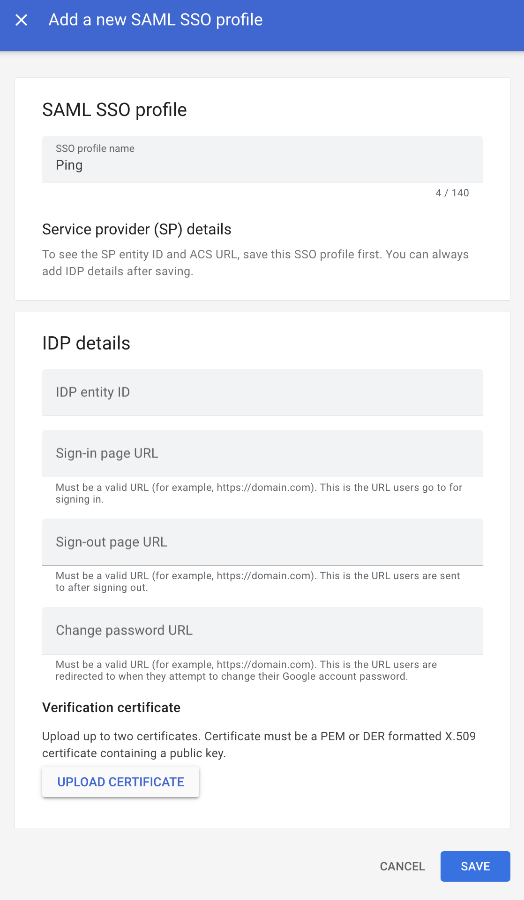
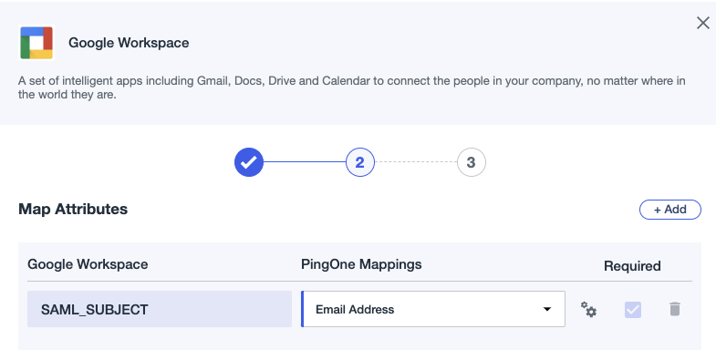
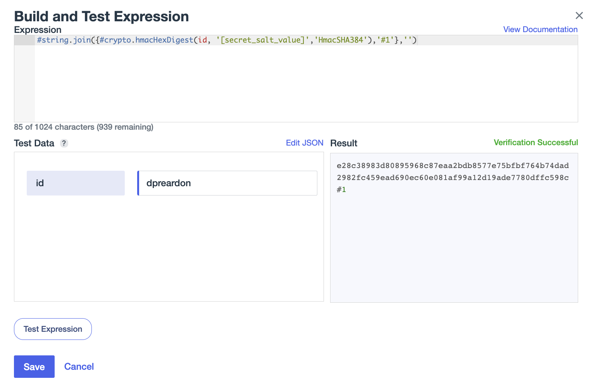

# Ping Identity SSO to Google Cloud

This documentation provides a seamless integration between PingOne SSO Authentication and Google Cloud Single Sign-On (SSO). With this integration, users can use their Ping credentials to sign in to Google Cloud services and applications, without the need for a separate set of Google Cloud credentials. This saves time and effort for both end-users and IT administrators, who can manage user access to Google Cloud resources through Ping Authentication.

The following resources from Ping can also be used to establish this connection.
* [PingFederate Google Workspace Connection](https://docs.pingidentity.com/r/en-us/pingfederate-google-workspace-connector)
* [PingOne Google Workspace Connection](https://docs.pingidentity.com/r/en-us/pingone/pingone_t_create_google_workspace_connection)

## Single Sign On (SSO)

### Google Admin Console Initial Configuration
|     |      |
|:--- |----: |
|<ul type="square"><li>In the Google Cloud Admin Console, go to Security -> Authentication -> SSO with third party IDP</li><li>Add a new SAML Profile</li><li>Give the Profile a name, for example "Ping" and hit "Save"</li><li>Keep track of the "EntityID" and "ACS URL" that you are given, we'll use those during the setup inside of Ping. Additionally, we'll return to this page later and add more detail</li></ul>| | 

### Initial Ping Identity Google Workspace Configuration
|     |      |
|:--- |----: |
|<ul type="square"><li>Inside of the PingIdentity console, go to Connections -> Application Catalog and add the Google Workspace Application</li><li>Add your Google Workspace Domain and the EntityID will be pre-populated based on your domain. We will edit this later to match the EntityID you received from the Google Cloud Admin Console, click "Next"<li>Use "Email Address" as the PingOne Mapping field for the SAML Subject, click "Next"</li><li>Select any Ping Identity groups for whom you want to have this application enabled, click "Save"</li></ul>|     | 

### Complete Ping Identity Google Workspace Configuration
|     |      |
|:--- |----: |
|<ul type="square"><li>Inside of the Ping Identity Console, go to Connections -> Applications and select "Google Workspace"</li><li>On the Configuration tab, replace the ACS URLs and Entity ID values with the values you received from the Google Admin Console earlier</li><li>Download the Signing Key and keep track of the Issuer ID, Single Logout Service and Single Signon Service URLs as these will all be needed in the Google Admin Console profile later</li><li>Change the Subject NameID Format to "urn:oasis:names:tc:SAML:1.1:nameid-format:emailAddress", click "Save"</li><li>If you want to enable the MFA profile, do this on the "Policies" tab</li><li>A complete example setup is down to the right</li></ul>|              |

### Google Admin Console Configuration Completion
|     |      |
|:--- |----: |
|<ul type="square"><li>In the Google Cloud Admin Console, return to Security -> Authentication -> SSO with third party IDP</li><li>Select your Ping profile under "Third-party SSO profile"</li><li>In the "IDP details" section, click the edit pencil and fill in the required information based on the values you obtained from your Ping Identity Google Workspace configuration earlier.</li><li>Upload the certificate you downloaded from the Ping console earlier</li><li>A completed example is shown to the right.</li></ul>|  | 

## Provisioning
|     |      |
|:--- |----: |
|<ul type="square"><li>Inside of the Ping Identity Console, go to Connections -> Provisioning and create a new connection</li><li>Search for the Google Workspace connection and add it to your account</li><li>The OAuth configuration is necessary to set up credentials that will be used to provision users. The guidance can be followed here: <a href="https://docs.pingidentity.com/r/en-us/pingfederate-google-workspace-connector/pingfederate_google_workforce_connector_obtain_an_application_name-_client_id-_and_secret">OAuth Setup in Google and Ping Identity</a></li><li>Now that you have a connection established, you'll need to configure the rules for provisioning. Inside of the Ping Identity Console, go to Connections -> Provisioning and add a new rule</li><li>NOTE: To obfuscate passwords being assigned to the Google Cloud Identity accounts when synced, I used the following expressing:   * #string.join({#crypto.hmacHexDigest(id, '[secret_salt_value]','HmacSHA384'),'#1'},'')</ul>|              |

## Validating

### SP-Initiated
* https://auth.pingone.com/[SSO_PingEnvironmentID]/saml20/idp/startsso?spEntityId=[GoogleCloudAdminEntityID]
* https://apps.pingone.com/[SSO_PingEnvironmentID]/myapps/

### IDP-Initiated
* https://console.cloud.google.com

| Scenario    | Example  |
|:--- |----: |
|  Ping SSO Login w/ Ping MFA   |  |
|  Ping SSO Login w/ Google MFA   |  |
|  Ping SSO Login w/ Ping and Google MFA   |  |
|  Ping SSO Login w/ No MFA   |  |
